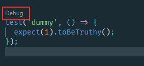

### Debugging all jest tests in VS Code

I do love jest and make use of the vscode-jest extension in VS Code which is super light and has all the primary features I need. I do however wish by default you could be able to debug all tests, not just failing or unknown tests.

The good news is it's super easy to configure this. Add or update the settings.json file in .vscode to include the following:

```json

{
    "jest.debugCodeLens.showWhenTestStateIn":["fail", "pass", "unknown"]
}

```

Now you can debug tests in any state, sweet!

